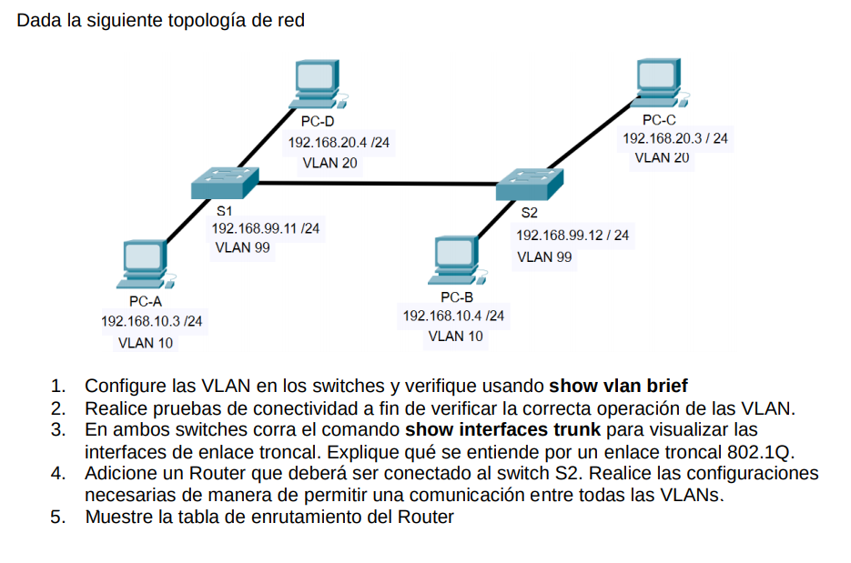
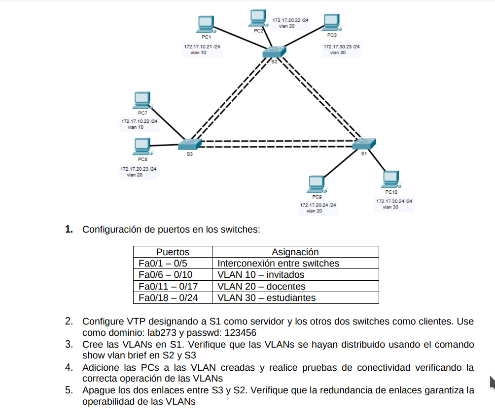

## ejercicio 1

solución en el ejercicio ejercicio1_vlan.pkt

Tambien existe la version 2 solución en el ejercicio ejercicio1_vlan_version2.pkt que es con cable directo.

## ejercico 2

solución en el ejercicio ejercicio2_vlan.pkt

